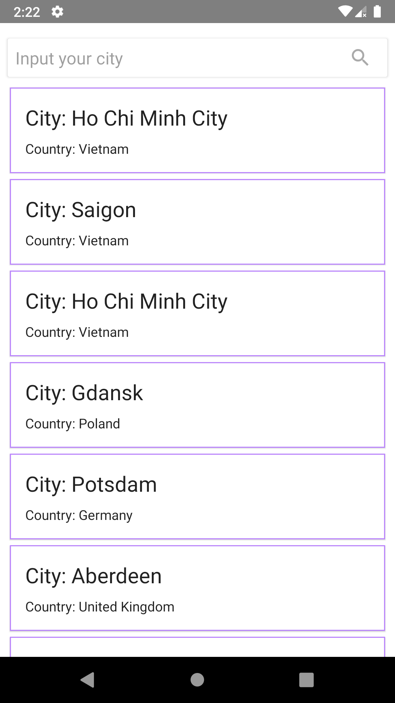
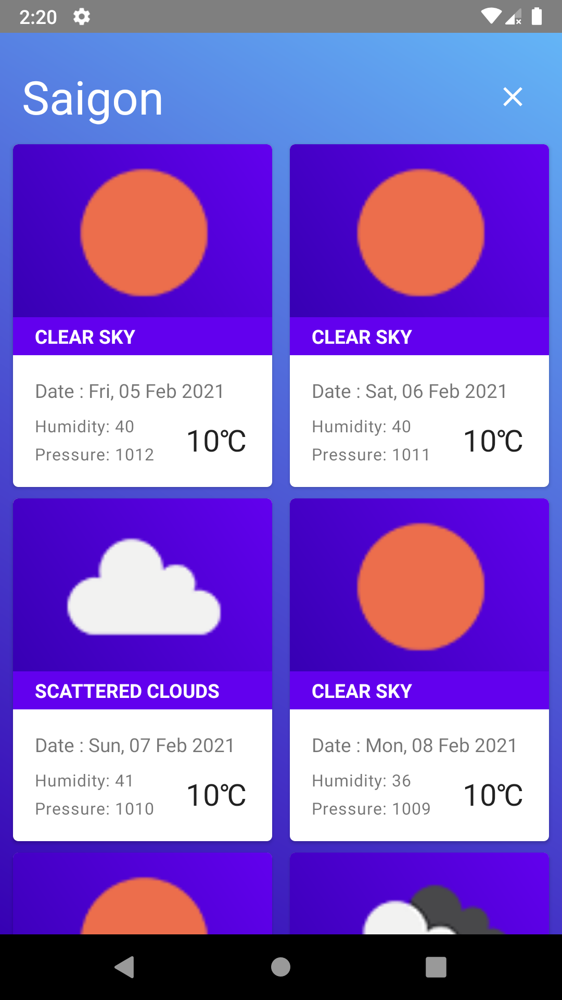

 Daily forecast
===

Application Architecture
------------------------
The project uses MVVM architecture pattern and mixed with clean architecture. It's based on the [todo-mvvm][1]  
 


It also mixed with domain layer to divided some basic [use-case][2] 

UI/UX
-----
We have two screen :
** 1 input country . The data response will be cached with Room and can be reused at the next launch -> if user search more the records storage in local will be increase.
{ width=50% }


** 2 Detail scree: show the data of the daily forecast can auto retry if there are no connection.

{ width=50% }

Project setup and Tech Used
---------------------------


Tech used : 
*   DB:Room with nested data and type convert
*   Network: Retrofit
*   Architecture components: android jetpacks ( view modle, view binding, live data,  material components, rxjava3, glide), Hilt ( DI )
*   Retry network use [ConnectionLiveData.kt](app/src/main/java/m/n/dailyforecast/utils/ConnectionLiveData.kt)
*   Encrypt : `AES/CBC/PKCS5PADDING` encrypt config at gradle level
*   SVC: git, gitlab


Security Config
---------------
The project created a config file [config.properties](config.properties) to store all the key or config. This file can be replace with CI/CD in build time script for safer with production mode

All keys in config file has been encrypted and the password can be load from environment variable in the real app.
decrypt gradle script:
```
static String secureDecrypt(String pass, String vector, String value) {
    def cipherText = value.decodeBase64()
    def bytesVector = vector.getBytes("UTF-8")
    def iv = new IvParameterSpec(bytesVector)
    Cipher cipher = Cipher.getInstance("AES/CBC/PKCS5PADDING")
    SecretKeySpec key = new SecretKeySpec(pass.getBytes("UTF-8"), "AES")
    cipher.init(Cipher.DECRYPT_MODE, key, iv)
    new String(cipher.doFinal(cipherText), "UTF-8")
}
```

Loading config: 

```
def configProperties = new Properties()
def configPropertiesFile = rootProject.file('config.properties')
if (configPropertiesFile.exists()) {
    configProperties.load(new FileInputStream(configPropertiesFile))
}
def pass_decryption = configProperties['PASSWORD']
def location_key = secureDecrypt(pass_decryption, pass_decryption, configProperties['LOCATION_KEY'])
def app_id_key = secureDecrypt(pass_decryption, pass_decryption, configProperties['APP_ID'])
```

Simple flavor config:
```
productFlavors {
        development {
            applicationIdSuffix ".development"
            resValue "string", "app_name", "DailyForecast Dev"
            buildConfigField "String", "LOCATION_KEY", "\"$location_key\""
            buildConfigField "String", "APP_ID", "\"$app_id_key\""
        }
        staging {
            applicationIdSuffix ".staging"
            resValue "string", "app_name", "DailyForecast Staging"
            buildConfigField "String", "LOCATION_KEY", "\"$location_key\""
            buildConfigField "String", "APP_ID", "\"$app_id_key\""
        }
        production {
            resValue "string", "app_name", "DailyForecast"
            buildConfigField "String", "LOCATION_KEY", "\"$location_key\""
            buildConfigField "String", "APP_ID", "\"$app_id_key\""
        }
    }
```

[1]: https://github.com/googlesamples/android-architecture/tree/todo-mvvm-databinding
[2]: app/src/main/java/m/n/dailyforecast/domain